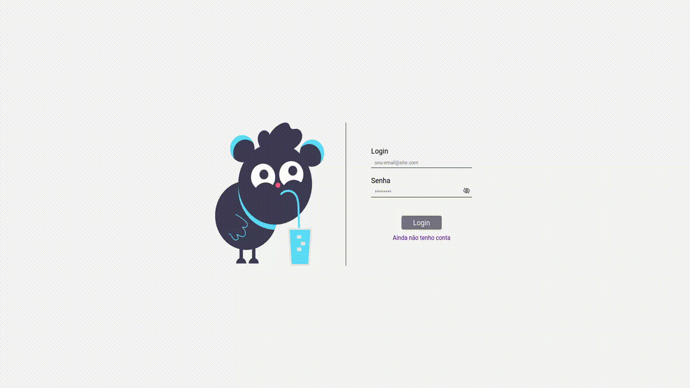

# Sips & Sips Delivery

Sips Delivery é um aplicativo Full Stack para dar suporte a uma distribuidora de bebidas. Este aplicativo oferece suporte a clientes, vendedores e ao administrador. Desenvolvido por [Guilherme Palma](https://github.com/guilhermepallma), [Ronan Salvador](https://github.com/ronansalvador), [Celso Rodrigo](https://github.com/celso-rodrigo), [Helder Daniel](https://github.com/helderdsa) e [Marcelo Carvalho](https://github.com/MarceloJRC).

[Acesse a Demo](https://sips-delivery.vercel.app)

## Detalhes

- Cliente: Como consumidor, é necessário fazer login ou se registrar, caso ainda não tenha uma conta. Assim, terá acesso a uma lista de produtos que poderão ser adicionados ao carrinho. Ao selecionar os produtos, será redirecionado para a tela de checkout, onde poderá revisar seu pedido e, posteriormente, finalizá-lo. Além disso, terá acesso ao histórico completo de seus pedidos.

- Vendedor: Caso esteja registrado como vendedor, será possível fazer login e acessar todo o seu histórico de pedidos. Ao clicar em um pedido, poderá visualizar todos os detalhes do mesmo.

- Administrador: Caso seja um usuário administrador, poderá fazer login e acessar a página de gerenciamento de vendedores. Nesta página, será possível visualizar todos os vendedores e clientes cadastrados, além de poder adicionar novos usuários.

## Tecnologias Utilizadas

    
    
    
    
    
    

 

- Node.js: Plataforma de desenvolvimento de software em JavaScript para construir aplicativos de rede escaláveis.
- React.js: Biblioteca JavaScript para a criação de interfaces de usuário — ou UI (user interface).
- Express: Framework para Node.js que fornece recursos para construir aplicativos da Web.
- MySQL: Banco de dados SQL relacional open-source.
- JWT: Biblioteca para gerar e verificar tokens JWT (JSON Web Tokens).
- Docker: Software de código aberto usado para implantar aplicativos dentro de containers virtuais.

## Deploy

  
  

- Heroku: Hospeda a api Node.js e o banco de dados MySQL.
- Vercel: Hospeda o frontend em React.js.
  
  [Acesse a Demo](https://sips-delivery.vercel.app)
  
## Execução

  
Clique para expandir!

  Para executar a aplicação inicie realizando o clone deste repositório com o comando abaixo.

    git clone git@github.com:guilhermepallma/delivery-app.git

  Navegue até a raíz do projeto.

    cd delivery-app/
    
  Suba o contêiner do banco de dados no Docker.
    
    docker-compose up -d
    
  Instale as dependência básicas para rodas os scripts.
  
    npm install
    
  Inicie a aplicação e popule o banco de dados.
  
    npm run dev:prestart
    

## Como Fazer Login

##### Acessar como cliente

 Para fazer login como usuário comum, você deve se registrar clicando em "Ainda Não Tenho Uma Conta"

##### Entrar como vendedor

  Para fazer login como vendedor, use as seguintes credenciais:

      email: vendedor@email.com
      passsword: senha123

##### Entrar como administrador

  Para fazer login como administrador, use as seguintes credenciais:

      email: administrador@email.com
      passsword: senha123

